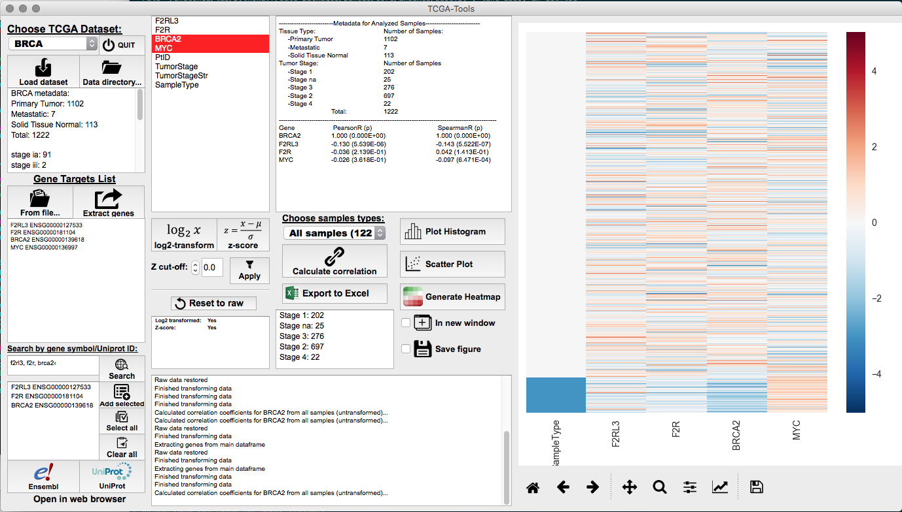

# TCGA-Tools-GUI
User-friendly, graphical interface for easily performing basic analysis and visualization of RNA-seq data publicly available from [The Cancer Genome Atlas (TCGA)](https://cancergenome.nih.gov/).  Currently only supports loading locally-available TCGA datasets that have been parsed and aggregated using [TCGA-Tools](https://github.com/ThomasHSmith/TCGA-Tools).

## Features
- Easily view dataset metadata, including solid vs. metastatic samples and staging information when available.
- Extract gene expression data from datasets by entering Ensembl Gene ID.
	- Built-in search tool allows for easy batch retrieval of Ensembl Gene IDs from gene symbols or Uniprot IDs (queries www.uniprot.org).
- Perform simple log2-transformation of raw expression data (FPKM-UQ) or represent data as z-scores.
- Calculate Pearson and Spearman correlation values between genes of interest.
- Plot histograms of individual gene expression profiles.
- Generate scatter plots to visualize co-expression of two genes.
- Create heatmaps to visualize expression profiles of several genes of interest, and how they vary in normal vs. tumor samples.
- Export raw or transformed data to Excel.
- Subset data based on tumor stage metadata to interrogate how gene expression changes with tumor progression.

## Dependencies
- **Python2.7** - Pandas, Numpy, Scipy, Seaborn, PyQt4.
- Not compatible with Python 3 or PyQt5.

## Authors

* **Thomas Smith** - [ThomasHSmith](https://github.com/ThomasHSmith)
